# Validation 

## HTML validation
### Home | home.html validation
Errors founded
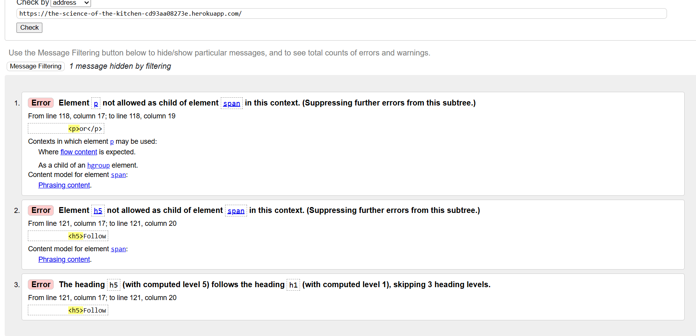
Errors fixed
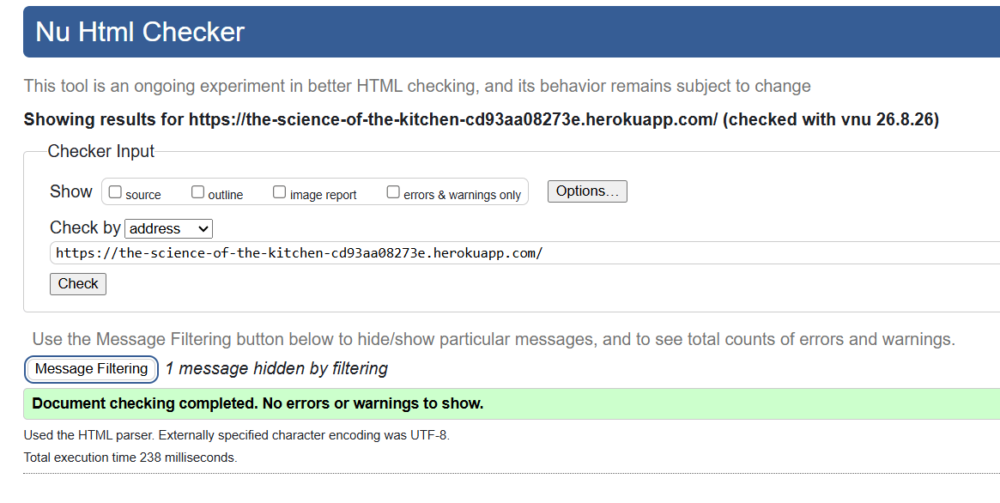

### Blog | article_list.html
Passed
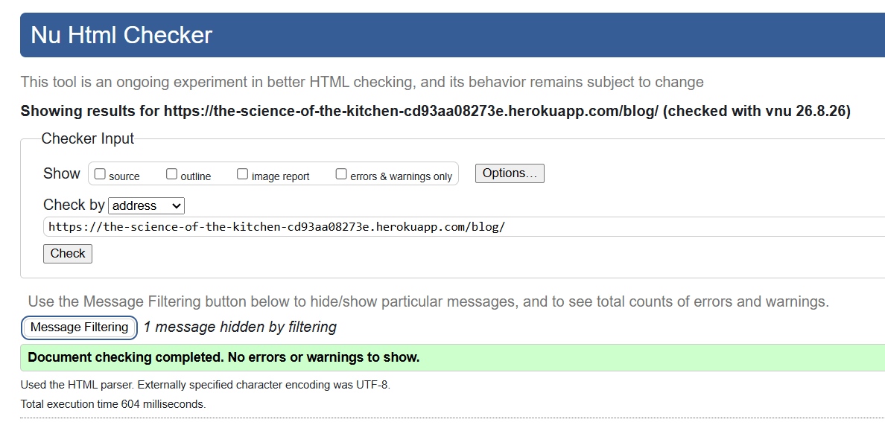

### Blog | article_detail.html
Errors founded
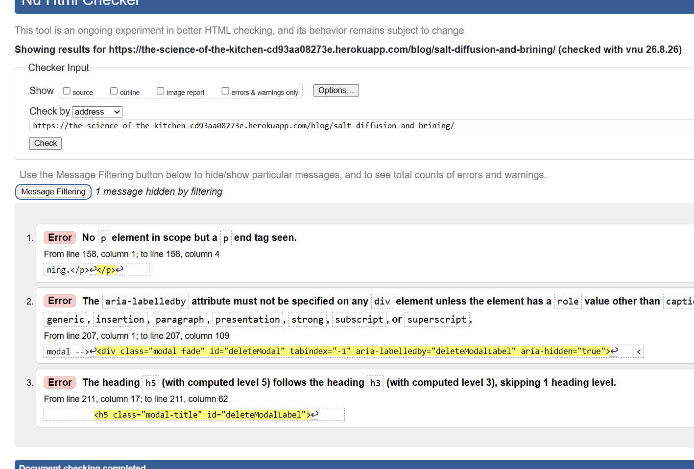
Errors fixed
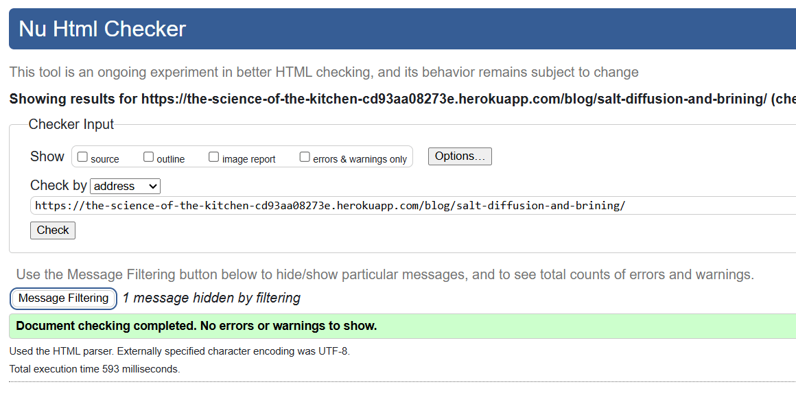

### About | about.html
Errors founded
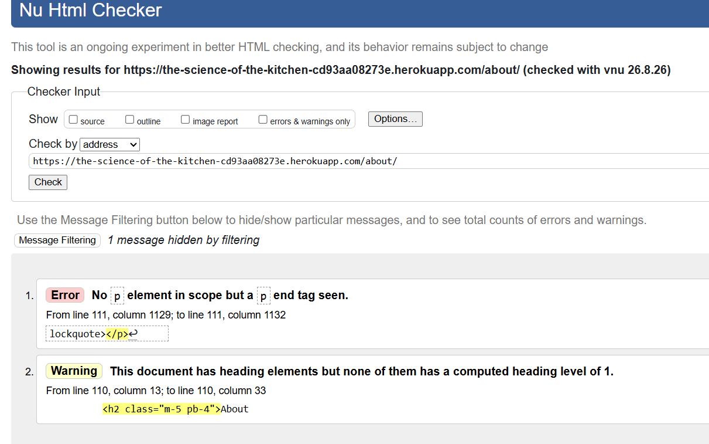
Errors fixed
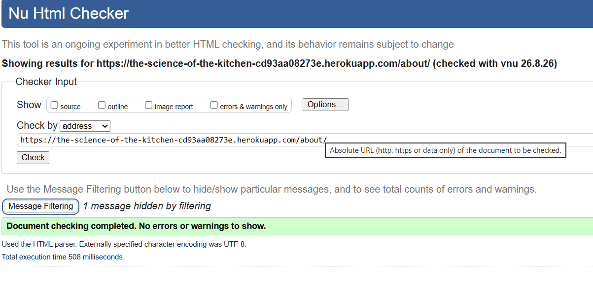

### Signup | signup.html
Errors founded
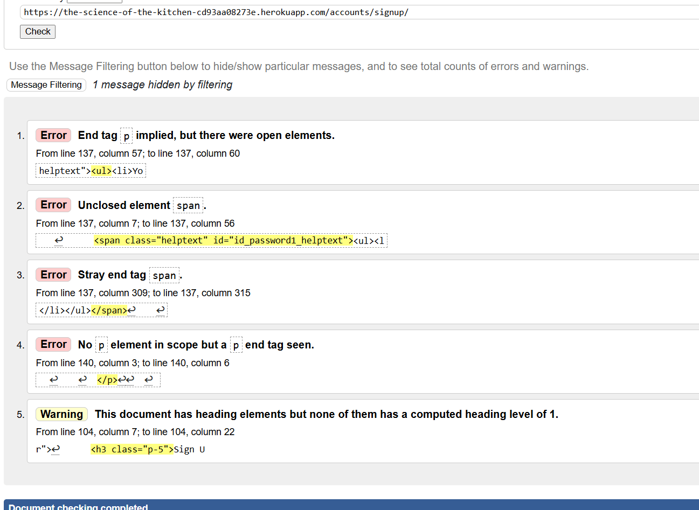
Errors fixed
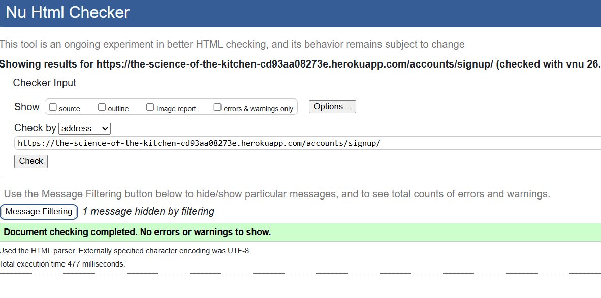

### Login | login.html
Errors founded
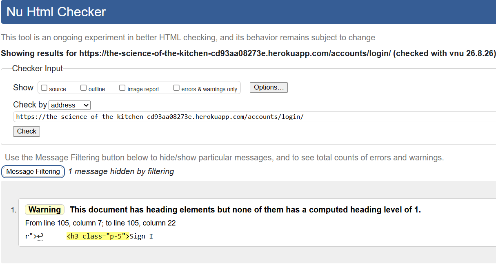
Errors fixed
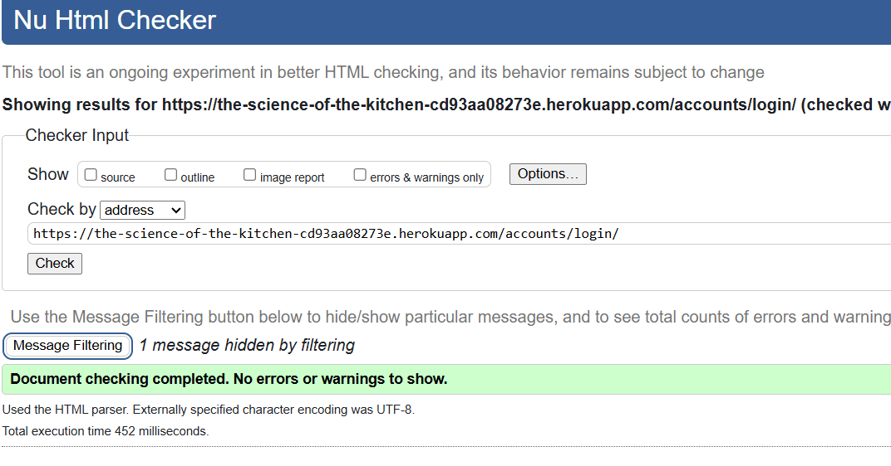

### Logout | logout.html
Pass
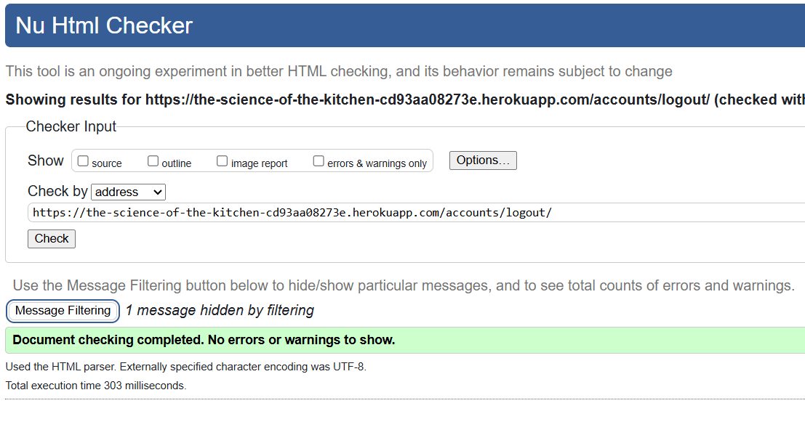

## CSS validation
## JavaScript validation
## Python validation
## Lighthouse validation
# Manual testing