# Manual testing

| Feature/Test | Expected Outcome | Result |
| --- | --- | --- |
| Name of the blog in Navbar | Redirects to homepage | Pass |
| Navbar links | Redirect to relevant pages (Blog, About Us, Categories,(Sign in-Log in-Log out), and Search ) | Pass |
| Footer Contact Us link | Redirect to About us page | Pass |
| Footer social Links | Open relevant sites in new tabs | Pass |
| Blog page | Display 6 articles with images, title, category and author | Pass |
| Click on Article | Redirects to article detail | Pass |
| Click on Category | Redirects to article list with the selected category's articles | Pass |
| Search with keyword | Redirects to article list and display articles that contains the relevant keyword | Pass |
| Pagination | Next/Previous buttons load correct pages and hold a search keyword if prompted | Pass |
| Sign Up Link | Redirects to registration page | Pass |
| Sign Up Form; empty field | Prompt to complete form | Pass |
| Sign Up Form; username already used, short password, common password | won't continue and would return red alerts | Pass |
| Sign Up Form; valid new user | Redirects to homepage with a success notification | Pass
| Login Link | Redirects to login page | Pass |
| Log in with empty fields | Prompt messages to compile the fields | Pass. |
| Login with incorrect values | display error messages | Pass |
| Login with correct values | redirects to homepage with success message | Pass |
| Navbar when Logged out | display register and log in | Pass |
| Navbar When Logged in | display log out | Pass |
| Empty collaboration form | prompt to complete form | Pass |
| Completed collaboration form | displays success message and sends the request | Pass. |
| Leaving a comment | if user logged, can leave the comment, and get a success message. If not, can't and need to log in to be able  | Pass. |
| If user logged | comment form and submit button are displayed displayed   | Pass. |
| Edit, delete and update button| Are displayed only to the user that left the comment | Pass. |
| Updating a comment | display a success message and update the comment | Pass. |
| Deleting a comment | appear a modal to ask confirmation for deletion | Pass. |
| Confirming deletion | display a success message and delete the comment | Pass. |
| Logout Button. | Redirects to logout confirmation page. | Pass. |
| Logout Confirmation. | Displays confirmation before logging out. | Pass. |
| Responsive Design | the site is responsive on multiple devices | Pass. |

# Validation 

## HTML validation using W3C HTML validator
### Home | home.html validation
Errors founded

Errors fixed

### Blog | article_list.html
Passed

### Blog | article_detail.html
Errors founded

Errors fixed

### About | about.html
Errors founded

Errors fixed

### Signup | signup.html
Errors founded

Errors fixed

### Login | login.html
Errors founded

Errors fixed

### Logout | logout.html
Pass

## CSS validation W3C CSS validator
Passed with 4 warnings
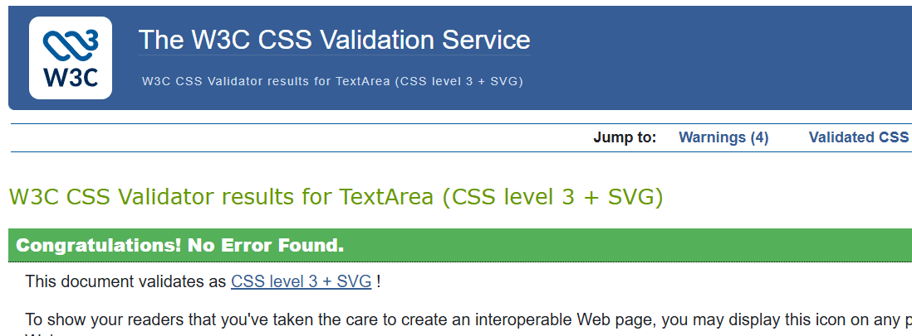
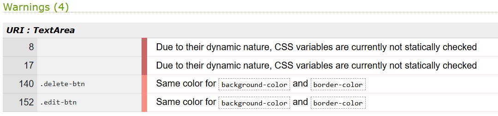
Eliminated the redundant css style, the other two warnings refer to the root class.
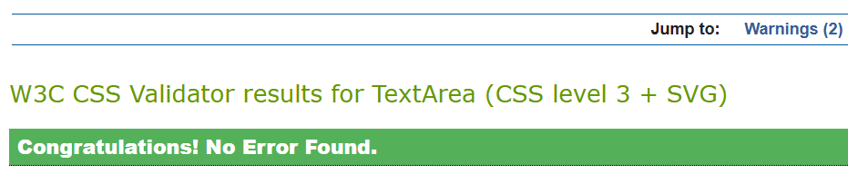
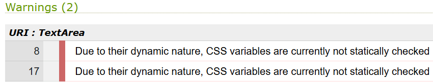

## JavaScript validation using JSHint
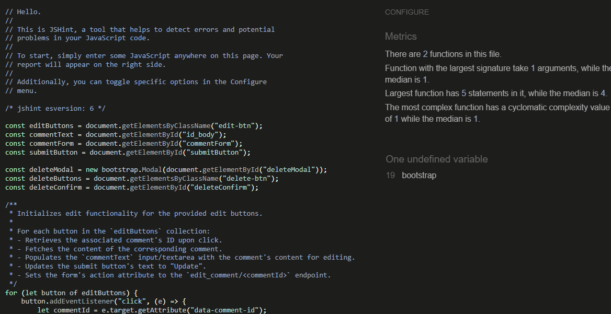

## Python validation using PEP8CI link
About | views.py
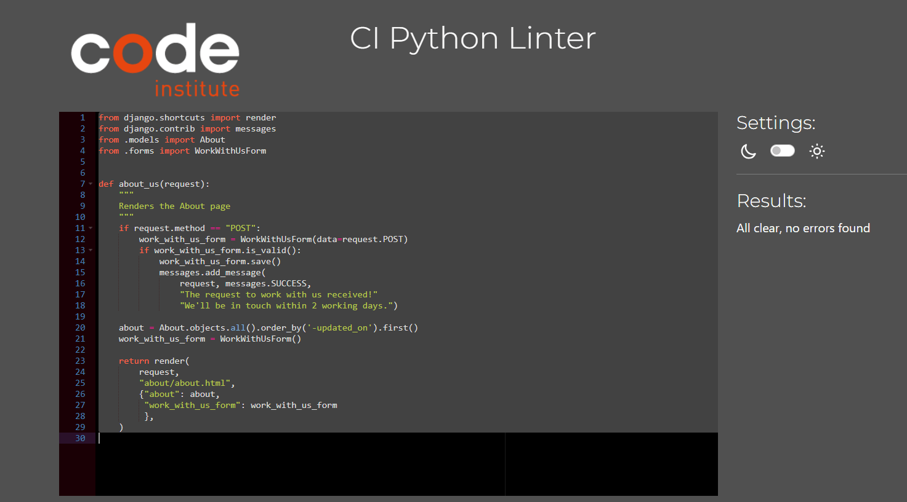
About | models.py 
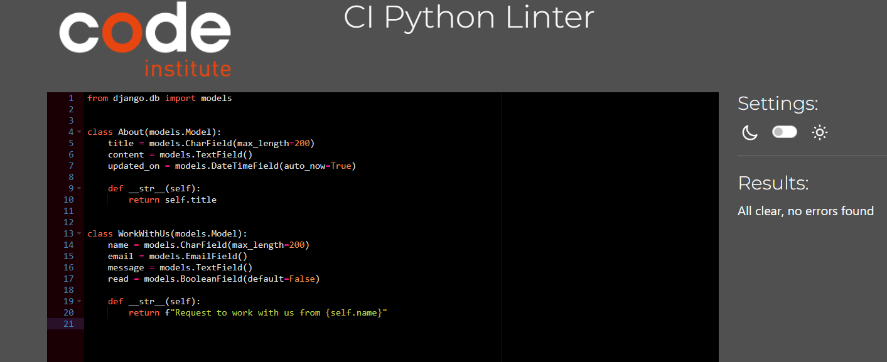
Blog | views.py
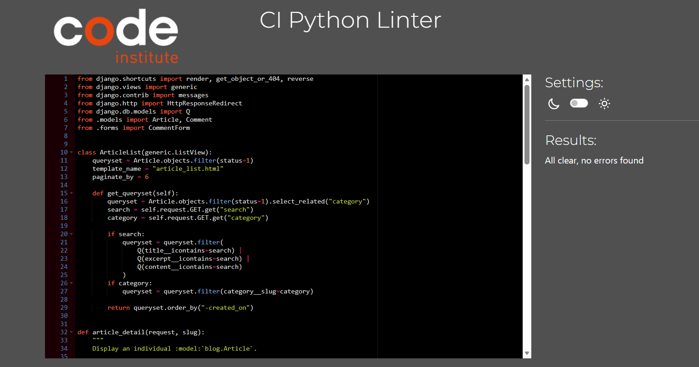
Blog | models.py
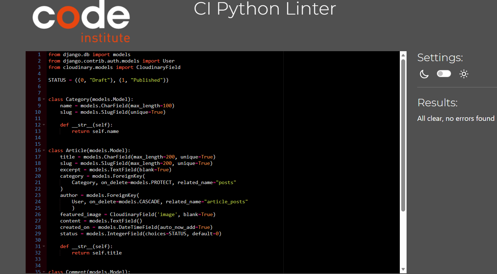
## Lighthouse validation
Homepage
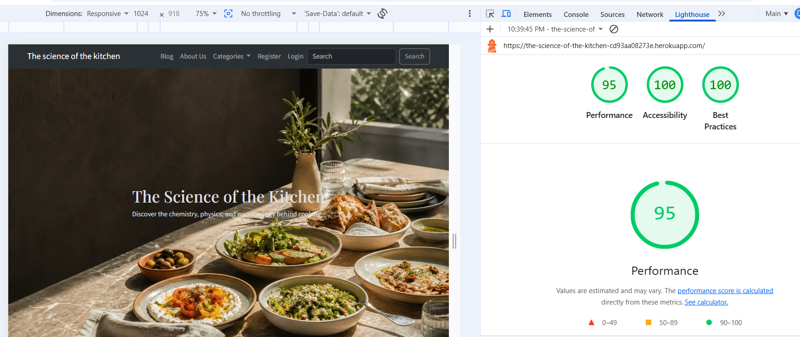
Blog page
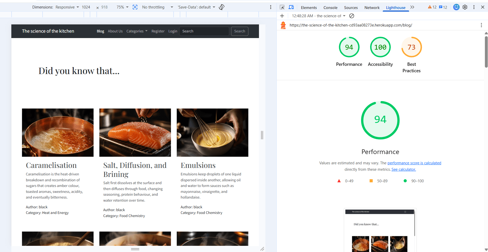
The low score on the blog page is due to unsecure resources loaded from cloudinary over HTTP instead HTTPS. As future improvement will be to review and update existing image URLs in the database.
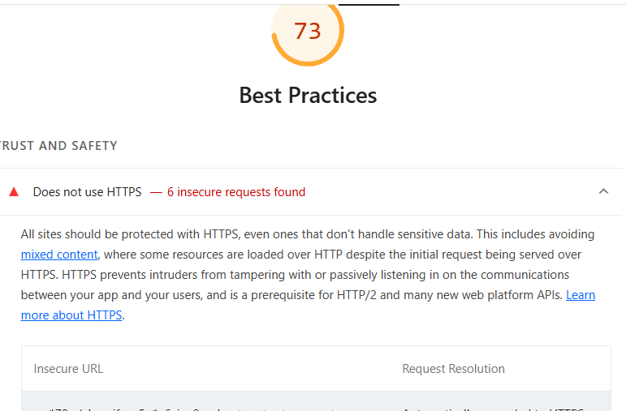
Article detail page
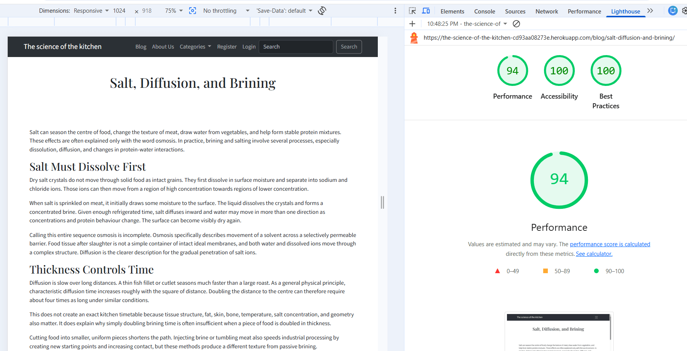
About us page
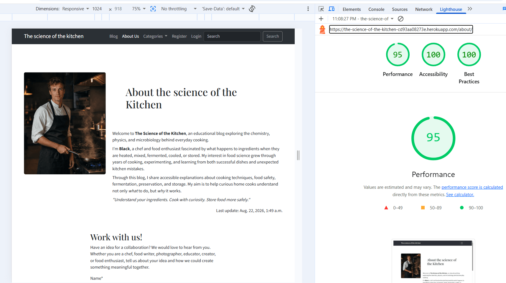